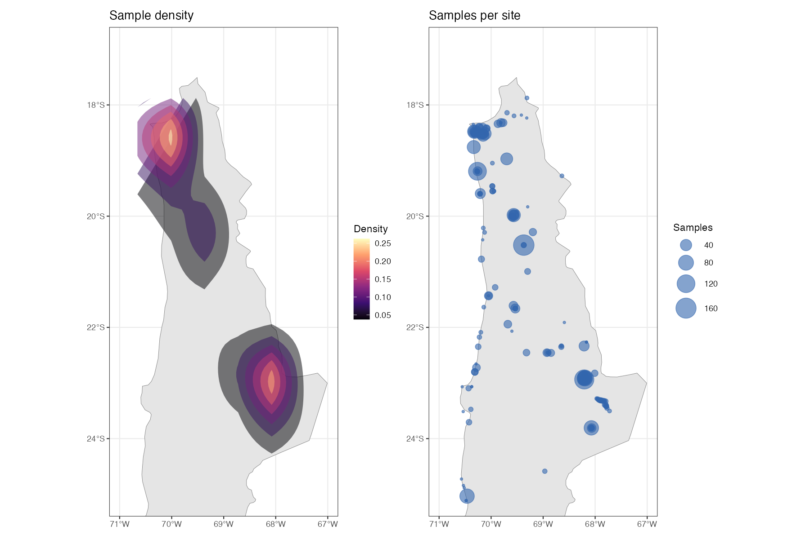

# ARID — Atacama Repository of Isotopic Data

ARID is an open, collaborative repository of isotopic data for the Atacama Desert of northern Chile, covering the regions of Arica y Parinacota, Tarapacá, and Antofagasta. It compiles published isotopic measurements from human, animal, and plant samples into a set of clean, analysis-ready datasets accessible directly from R.

## Installation

```r
# Install from GitHub
remotes::install_github("mayorgarmijo/arid")
```

## Datasets

ARID includes four datasets:

| Dataset | Description | Rows |
|---|---|---|
| `arid_humans` | Isotopic data from human skeletal and soft tissue samples | 1,821 |
| `arid_animals` | Isotopic data from faunal remains | 362 |
| `arid_plants` | Isotopic data from botanical remains | 576 |
| `arid_sites` | Archaeological site information with geographic and chronological context | 203 |

All datasets cover the full chronological sequence of northern Chile.

### Key isotopic variables

| Variable | Description |
|---|---|
| `d13C` | δ¹³C from organic tissue (collagen, keratin, or soft tissue) (‰ VPDB) |
| `d15N` | δ¹⁵N from organic tissue (‰ AIR) |
| `d34S` | δ³⁴S (‰ VCDT) |
| `d13C_carbonate` | δ¹³C from bone/enamel apatite (‰ VPDB) |
| `d18O_carbonate` | δ¹⁸O from bone/enamel apatite (‰ VPDB) |
| `Sr87_Sr86` | ⁸⁷Sr/⁸⁶Sr ratio |
| `wt_C`, `wt_N`, `CN_ratio` | Collagen quality indicators |
| `tissue` | Tissue type for organic isotope measurements (e.g. Bone collagen, Hair keratin) |

## Geographic coverage

ARID currently includes samples from 203 archaeological sites across three administrative regions of northern Chile. The maps below show the spatial distribution and sample density across the study area.



Samples are classified by:

- **`admin_region`**: Arica y Parinacota · Tarapacá · Antofagasta
- **`ecozone`**: Coast (< 130 masl) · Lowlands (130–1700 masl) · Precordillera (1700–3700 masl) · Altiplano (> 3700 masl)
- **`locality`**: Specific site locality (e.g. Lower Azapa Valley, Loa basin, San Pedro de Atacama Oasis)

## Usage

```r
library(ARID)

# Access datasets directly
head(arid_humans)
head(arid_sites)

# Merge sample data with site context
humans_with_context <- arid_merge("humans")

# Combine all tables
all_samples <- arid_merge()

# Filter by ecozone
library(dplyr)
coastal <- arid_merge("humans") |>
  filter(ecozone == "Coast")

# Filter by administrative region
antofagasta <- arid_merge("humans") |>
  filter(admin_region == "Antofagasta")

# Filter by tissue type
collagen_only <- arid_merge("humans") |>
  filter(grepl("collagen", tissue, ignore.case = TRUE))

# Long format for tissue-level analysis
humans_long <- arid_merge("humans", long = TRUE)
```

## The `arid_merge()` function

`arid_merge()` joins any combination of sample tables with `arid_sites`, adding geographic and chronological context to each sample.

```r
# Single table
arid_merge("humans")
arid_merge("animals")
arid_merge("plants")

# Multiple tables — adds a 'source' column
arid_merge(c("humans", "animals"))
arid_merge()  # all three tables

# Long format — one row per tissue block (organic / carbonate)
arid_merge("humans", long = TRUE)
```

## Data sources

ARID compiles data from peer-reviewed publications. Each record includes a short citation (`reference_short`) and a DOI (`doi`) linking to the original source.

This repository is derived from the South American Archaeological Isotopic Database (SAAID), filtered to the Atacama Desert region of northern Chile.

## Contributing

Contributions are welcome. To add new data or correct existing records, please open an issue or submit a pull request on [GitHub](https://github.com/mayorgarmijo/arid).

## License

Data: [CC BY 4.0](LICENSE.md)
