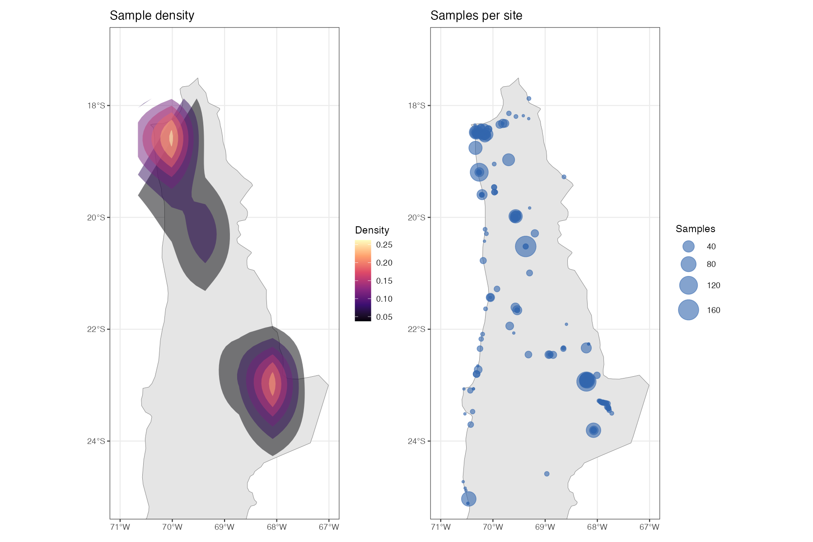

# ARID — Atacama Repository of Isotopic Data

ARID is an open, collaborative repository of isotopic data for the Atacama Desert of northern Chile, covering the regions of Arica y Parinacota, Tarapaca, and Antofagasta. It compiles published isotopic measurements from human, animal, and plant samples into a set of clean, analysis-ready datasets accessible directly from R.

## Installation

```r
# Install from GitHub
remotes::install_github("mayorgarmijo/arid")
```

## Datasets

ARID includes five datasets:

| Dataset | Description | Rows |
|---|---|---|
| `arid_humans` | Isotopic data from human skeletal and soft tissue samples (long format) | 3,298 |
| `arid_animals` | Isotopic data from faunal remains (long format) | 602 |
| `arid_plants` | Isotopic data from botanical remains | 1,028 |
| `arid_sites` | Geographic and chronological context for 437 archaeological sites | 437 |
| `arid_c14` | Radiocarbon dates from archaeological contexts in northern Chile | 1,202 |

### Long format (humans and animals)

`arid_humans` and `arid_animals` are stored in **long format**: one row per tissue analysed. Individuals with both organic (collagen, keratin) and carbonate (apatite) measurements appear in two rows, distinguished by the `tissue_type` column (`"organic"` or `"carbonate"`). This eliminates the `_carbonate` column family and makes tissue-specific filtering straightforward.

```r
# Only organic tissue rows
arid_filter(tables = "humans", tissue_type = "organic")

# Only carbonate rows
arid_filter(tables = "humans", tissue_type = "carbonate")
```

### Key isotopic variables

| Variable | Description |
|---|---|
| `d13C` | δ¹³C from organic or carbonate tissue (‰ VPDB) |
| `d15N` | δ¹⁵N from organic tissue (‰ AIR) |
| `d34S` | δ³⁴S (‰ VCDT) |
| `d18O` | δ¹⁸O from carbonate tissue (‰ VPDB; carbonate rows only) |
| `Sr87_Sr86` | ⁸⁷Sr/⁸⁶Sr ratio |
| `wt_C`, `wt_N`, `CN_ratio` | Collagen quality indicators |
| `tissue` | Tissue type (e.g. Bone collagen, Hair keratin, Bone apatite) |
| `tissue_type` | "organic" or "carbonate" |

### Chronological columns

All date values in ARID use the **BCE/CE** system (negative = BCE, positive = CE):

| Column | Description |
|---|---|
| `period_broad` | Broad period category (e.g. Archaic, Formative, Late Intermediate, Late) |
| `period` | Sub-period or phase (e.g. Early Archaic, Late Formative) |
| `period_from` | Start of cultural period (BCE/CE) |
| `period_to` | End of cultural period (BCE/CE) |
| `has_c14` | Whether a direct radiocarbon date exists in `arid_c14` |

## Geographic coverage

ARID currently includes samples from 437 archaeological sites across three administrative regions of northern Chile.



Samples are classified by:

- **`admin_region`**: Arica y Parinacota · Tarapaca · Antofagasta
- **`ecozone`**: Coast (< 130 masl) · Lowlands (130–1700 masl) · Precordillera (1700–3700 masl) · Altiplano (> 3700 masl)
- **`locality`**: Specific site locality (e.g. Lower Azapa Valley, Loa basin, San Pedro de Atacama Oasis)

## Functions

ARID provides three functions for accessing and working with the data.

### `arid_merge()`

Combines one or more sample tables into a single data frame. Each table already contains site-level context columns. When more than one table is selected, a `source` column is added to identify the origin of each row.

```r
library(ARID)

# Single table
arid_merge("humans")
arid_merge("animals")
arid_merge("plants")

# Multiple tables — adds a 'source' column
arid_merge(c("humans", "animals"))
arid_merge()  # all three tables
```

### `arid_filter()`

Wraps `arid_merge()` and applies contextual filters in one call. At least one filter argument must be provided. All arguments accept character vectors (OR logic within each argument, AND logic across arguments).

| Argument | Values |
|---|---|
| `tables` | `"humans"`, `"animals"`, `"plants"` (default: all three) |
| `ecozone` | `"Coast"`, `"Lowlands"`, `"Precordillera"`, `"Altiplano"` |
| `admin_region` | `"Arica y Parinacota"`, `"Tarapaca"`, `"Antofagasta"` |
| `period_broad` | `"Archaic"`, `"Formative"`, `"Late Intermediate"`, `"Late"`, `"Colonial"`, … |
| `period` | `"Early Archaic"`, `"Late Formative"`, … |
| `locality` | e.g. `"Lower Azapa Valley"`, `"San Pedro de Atacama Oasis"` |
| `tissue_type` | `"organic"`, `"carbonate"` (humans and animals only) |

```r
# Filter by ecozone
arid_filter(ecozone = "Altiplano")

# Multiple ecozones at once (OR logic)
arid_filter(ecozone = c("Coast", "Lowlands"))

# Filter by broad period
arid_filter(period_broad = "Formative")

# Filter by specific sub-period
arid_filter(period = "Late Formative")

# Combine filters (AND logic across arguments)
arid_filter(tables = "humans", ecozone = "Altiplano", admin_region = "Antofagasta")

# By locality
arid_filter(locality = "Lower Azapa Valley")

# Combine a contextual filter with tissue type
arid_filter(ecozone = "Coast", period_broad = "Formative", tissue_type = "organic")
```

### `arid_chronology()`

Assigns individual date ranges to samples. For samples with a direct radiocarbon date (`has_c14 == TRUE`), the calibrated range from `arid_c14` is used (linked via `lab_id`). For all other samples, the cultural period range (`period_from` / `period_to`) is used as a fallback. Three columns are added: `date_from`, `date_to`, and `date_source` (`"C14"` or `"period"`).

All internal dates are in BCE/CE. The `unit` argument converts them to cal BP on output.

```r
# Assign dates in BCE/CE (default; negative = BCE)
df <- arid_chronology(arid_merge("humans"))
head(df[, c("sample_id", "date_from", "date_to", "date_source")])

# In cal BP
df_bp <- arid_chronology(arid_merge("humans"), unit = "BP")

# Check how many samples have direct C14 dates vs. period estimates
table(df$date_source)

# Combine with arid_filter
coastal_archaic <- arid_filter(ecozone = "Coast", period_broad = "Archaic")
coastal_archaic <- arid_chronology(coastal_archaic)
```

## Quick start

```r
library(ARID)

# Explore a dataset
head(arid_humans)
head(arid_c14)

# All organic tissue rows for coastal humans
arid_filter(tables = "humans", ecozone = "Coast", tissue_type = "organic")

# Assign chronology and filter samples with direct C14 dates
df <- arid_chronology(arid_merge("humans"))
df[df$date_source == "C14", ]
```

## Citation

If you use ARID in a publication, please cite it as:

> Mayorga, D. (*year*). ARID: Atacama Repository of Isotopic Data. R package. https://github.com/mayorgarmijo/arid

## Data sources

ARID compiles data from peer-reviewed publications. Each record includes a short citation (`reference_short`) and a DOI (`doi`) linking to the original source.

```r
# List all sources cited in the package
unique(arid_merge()$reference_short)
```

## Contributing

Contributions are welcome. To add new data or correct existing records, please open an issue or submit a pull request on [GitHub](https://github.com/mayorgarmijo/arid).

## License

Code: [GPL (>= 3)](LICENSE.md) · Data: [CC BY 4.0](https://creativecommons.org/licenses/by/4.0/)
